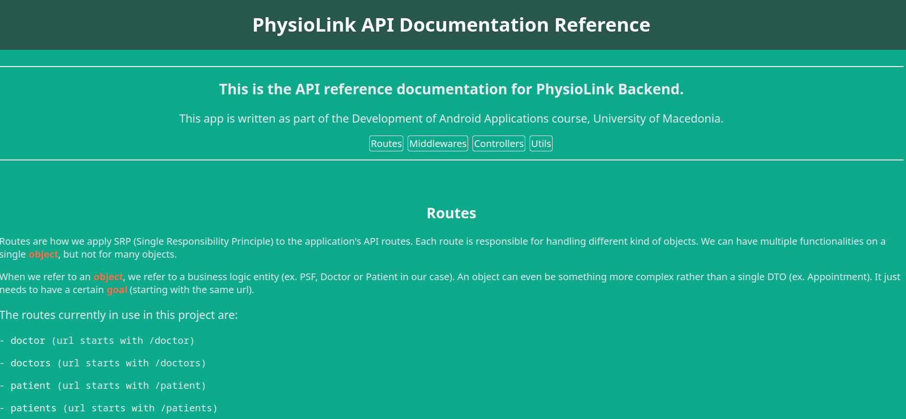

# PhysioLink-Backend
Backend source code for Development of Android Applications, University of Macedonia (UoM)
 
PhysioLink is a mobile app that aims to facilitate the management of physiotherapy clinics, as well as to assist patients in the appointment booking process. 
 
This app is written in Nodejs and specifically using the Expressjs framework. The database used is MariaDB.
 

### Team members (Team 11)
<ul>
    <li><b>Kote Kostandin</b></li>
    <li><b>Theodora Katseisvili</b></li>
    <li><b>Vicky Limenidou</b></li>
    <li><b>Charisiadis Aristotelis</b></li>
    <li><b>Panagiotis Stergioulas-Bolis</b></li>
    <li><b>Koudouni Alexandra</b></li>
    <li><b>Shenepremte Eleni</b></li>
    <li><b>Sophocles Panteris</b></li>
    <li><b>Iason Karafoulidis</b></li>
    <li><b>Christos Tsarchopoulos</b></li>
</ul>

### Functionalities
The backend app follows and supports the requirements as given from the assignment. 
Furthermore, extra functionalities were implemented, such as:
<ul>
	<li><b>Notification system</b></li>
	<li><b>Email system</b></li>
	<li><b>Profile Image uploading</b></li>
	<li><b>Personalized doctor/physiotherapist services</b></li>
	<li><b>Updating user information (password, name, email etc.)</b></li>
	<li><b>More patient/doctor information (city, address, postal code)</b></li>
</ul>

You can find out more about the functionalities in the [API Documentation Reference](https://github.com/setokk/PhysioLink-Backend/blob/main/documentation/mobile-documentation.html)

### Running the app
Although it is not needed since there is a live server, there are 2 ways to run the app (using docker or installing locally):

##### IMPORTANT
Because MariaDB listens on 3306, make sure there are no running processes using port 3306 before following the steps below.
#### - Docker (recommended)
<pre>
Requirements:
- Docker CLI or Docker Desktop

Run:
1) docker-setup.bat (or docker-setup.sh | they can be found in the root path of the project)
2) docker exec -it physiolink-db mariadb --user root -proot
3) Copy and paste all SQL code from db.sql in the interactive terminal (db.sql can also be found in the root path of the project)
4) Done!
</pre>

#### - Locally (not recommended)

<pre>
Requirements:
- Nodejs
- MariaDB

1) Clone the repository
2) Go to <a href="https://github.com/setokk/PhysioLink-Backend/blob/main/utils/db/DatabaseDriver.js">DatabaseDriver.js</a> and change the <i><b>"physiodb"</b></i> in "new DatabaseConnector(<b>"physiodb"</b>, "root", "root", DB_CONN_LIMIT)" to <i><b>"localhost"</b></i>
3) Run npm install and npm run start
4) Run this in your terminal: <b>mariadb -u root -p</b>
5) Copy and paste the code from <a href="https://github.com/setokk/PhysioLink-Backend/blob/main/db.sql">db.sql</a> to the terminal
6) Done!
</pre>

### Requirements
In summary, the requirements as stated above are:
<b>Docker</b> or <b>Nodejs</b> and <b>MariaDB</b>.

### Documentation
You can find the backend API reference in <a href="http://localhost:3000/physiolink/api">localhost:3000</a>, if run locally.

